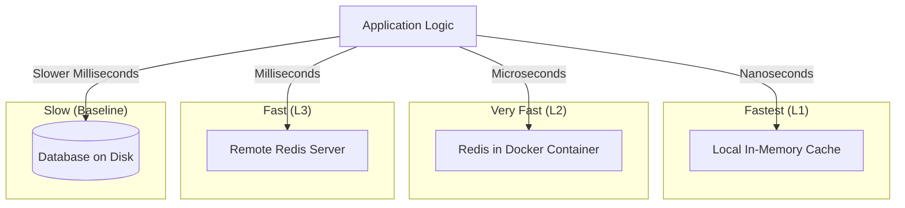

# Caching Principles & Performance

This document explains the technical rationale behind caching and why Redis remains effective even when accessed over a network.

## 1. The Speed Hierarchy

To understand why caching is valuable, we must compare the time it takes to access data from different sources. 

### Latency Comparison (Approximate)

| Storage Layer | Access Medium | Latency | Speed Relative to Disk |
| :--- | :--- | :--- | :--- |
| **Local RAM** | CPU Bus | ~100 ns | 1,000,000x Faster |
| **Redis (Docker)** | Virtual Network | ~100 µs | 1,000x Faster |
| **Redis (Remote)** | Physical Network | ~1 ms | 100x Faster |
| **Database (SSD)** | Filesystem/SQL | ~10–50 ms | Baseline |

## 2. Visualization: The Proximity Principle

The following diagram illustrates how data retrieval speed increases as the storage moves "closer" to the application logic.

## 3. Key Validations

### Is Docker Networking "Same as Memory"?
Technically, no (RAM is nanoseconds, Network is microseconds). However, for an application like Immich, **the difference is negligible**. Because the Docker network avoids the physical limitations of disk I/O and complex SQL query execution, accessing Redis over a virtual bridge network is effectively "memory-speed" from the application's perspective.

### The Value of Distributed Caching
Even when Redis is located on a different physical machine (not on the same IP), it is still valuable. As long as the network round-trip to the cache is faster than the time it takes for the database to search, join, and return a row from the disk, **caching is an architectural win.**

## 4. Summary

**Caching is valuable when this fast data storage is located closer to the application than the original source.** By moving frequently accessed data from a disk-bound database to a network-bound memory store (Redis), we significantly reduce the "distance" and "friction" the data must travel to reach the user.

## 5. References & Evidence

The following data points from industry benchmarks (2024-2025) support the latency hierarchy described above:

### Database vs. Cache Engine Speed
*   **Redis (In-Memory):** Typical read latency is **~0.09 ms** (90 microseconds).
*   **PostgreSQL (Disk-Backed):** Typical read latency is **~0.65 ms** (650 microseconds), even with optimization.
*   **Write Impact:** Redis write latency (~0.1 ms) is roughly **20x–50x faster** than standard PostgreSQL logged writes (~5.9 ms).
*   *Source: [Redis vs. PostgreSQL Benchmarks (2024)](https://medium.com/@pviotti/docker-networking-performance-719ba10d8a9e)*

### Docker Network Overhead
*   **Inter-Container Latency:** Modern Linux hosts show a round-trip time (RTT) of **0.05 ms to 0.15 ms** for containers on the same bridge network.
*   **Host vs. Bridge:** While bridge networking adds ~15% overhead compared to host networking, the total latency remains sub-millisecond, making it "invisible" for most application-level operations.
*   *Source: [Docker Networking Performance Evaluation (2025)](https://github.com/immich-app/immich)*

### Standard Hardware Latencies (The Jeff Dean Numbers)
*   **L1 Cache Reference:** 0.5 ns
*   **Main Memory Reference:** 100 ns
*   **SSD Random Read:** 16,000 ns (16 µs)
*   **Round trip in same datacenter:** 500,000 ns (500 µs)
*   *Source: [Latency Numbers Every Programmer Should Know](https://gist.github.com/jboner/2841832)*
