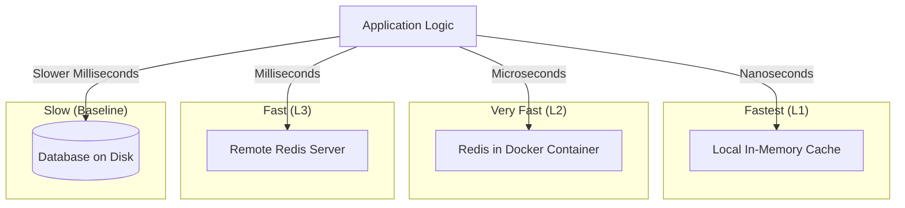

# Caching Principles & Performance

This document explains the technical rationale behind caching and why Redis remains effective even when accessed over a network.

## 1. The Speed Hierarchy

To understand why caching is valuable, we must compare the time it takes to access data from different sources. 

### Latency Comparison (Approximate)

| Storage Layer | Access Medium | Latency | Speed Relative to Disk |
| :--- | :--- | :--- | :--- |
| **Local RAM** | CPU Bus | ~100 ns | 1,000,000x Faster |
| **Redis (Docker)** | Virtual Network | ~100 µs | 1,000x Faster |
| **Redis (Remote)** | Physical Network | ~1 ms | 100x Faster |
| **Database (SSD)** | Filesystem/SQL | ~10–50 ms | Baseline |

## 2. Visualization: The Proximity Principle

The following diagram illustrates how data retrieval speed increases as the storage moves "closer" to the application logic.

## 3. Key Validations

### Is Docker Networking "Same as Memory"?
Technically, no (RAM is nanoseconds, Network is microseconds). However, for an application like Immich, **the difference is negligible**. Because the Docker network avoids the physical limitations of disk I/O and complex SQL query execution, accessing Redis over a virtual bridge network is effectively "memory-speed" from the application's perspective.

### The Value of Distributed Caching
Even when Redis is located on a different physical machine (not on the same IP), it is still valuable. As long as the network round-trip to the cache is faster than the time it takes for the database to search, join, and return a row from the disk, **caching is an architectural win.**

## 4. Summary

**Caching is valuable when this fast data storage is located closer to the application than the original source.** By moving frequently accessed data from a disk-bound database to a network-bound memory store (Redis), we significantly reduce the "distance" and "friction" the data must travel to reach the user.
