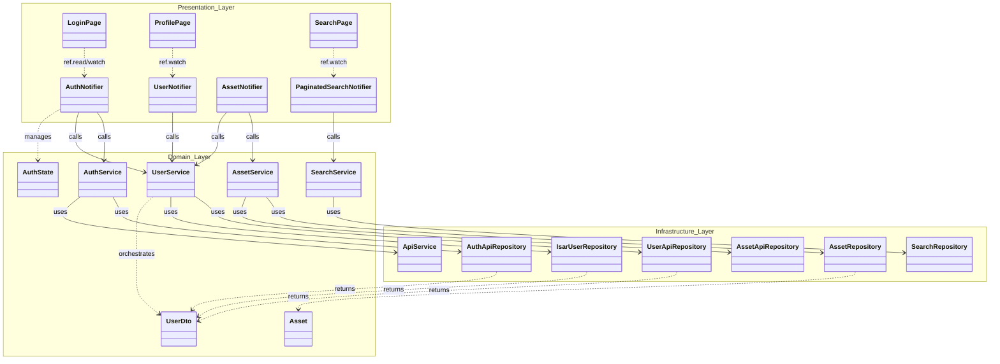

# Mobile Class Relationship Diagram

This diagram visualizes the primary classes in the Immich Flutter application and how they interact across different architectural layers.

## High-Level Domain Diagram

## Layer Responsibilities

### 1. Presentation Layer (Grey)
- **Pages/Widgets**: The visual components. They are "passive" and only react to state changes in the Notifiers.
- **Notifiers (ViewModels)**: Maintain the UI-specific state (e.g., `loading`, `error`, `data`). They bridge the UI and the Business logic.

### 2. Domain Layer (Blue)
- **Services**: The "Brains" of the app. They contain the business rules (e.g., "when a user logs in, fetch their profile and sync the local DB").
- **Models (DTOs)**: Simple data containers like `UserDto` or `Asset` that travel between layers.

### 3. Infrastructure Layer (Orange)
- **Repositories**: The "Workers." They handle the technical details of communication.
    - **ApiRepositories**: Handle HTTP requests to the Immich Server.
    - **DatabaseRepositories**: Handle local persistence (Isar/Drift).
- **ApiService**: A global utility that manages authentication tokens, base URLs, and HTTP headers for all network requests.
