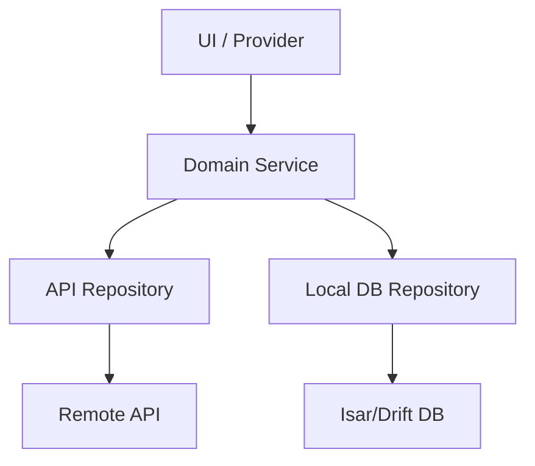

# Mobile Architecture Deep Dive

This document provides a detailed overview of the architectural design of the Immich Flutter application. It expands on the high-level concepts mentioned in the main architecture page, specifically focusing on the layered design and the orchestration of data flow.

## Architectural Layers

The mobile app follows a "Clean Architecture" inspired pattern, organized into four primary layers:

### 1. Domain Layer (`lib/domain`)
The **Brain** of the application. It contains the core business logic and is designed to be independent of external factors like the database or API.
- **Models**: Plain Dart classes representing business entities.
- **Interfaces**: Definitions for data operations (contracts).
- **Services**: Orchestrators that implement complex business rules by coordinating multiple repositories.

### 2. Infrastructure Layer (`lib/infrastructure`)
The **Implementation** details. This layer handles the "how" of data retrieval and persistence.
- **Repositories**: Concrete implementations of domain interfaces.
- **Entities**: Database schemas (Isar or Drift).
- **Loaders**: Specialized components for handling complex data loading (e.g., background isolates).

### 3. Presentation Layer (`lib/presentation` & `lib/pages`)
The **UI** and user interaction logic.
- **Pages**: Full-screen components.
- **Widgets**: Reusable UI components.
- **Notifiers (The ViewModel)**: While not explicitly called "ViewModels," Riverpod `Notifier` or `StateNotifier` classes fulfill this role. They:
    - Hold the specific state required by a view.
    - Expose methods for the UI to trigger actions.
    - Call Domain Services to execute business logic.
    - Reside in `lib/providers` or alongside their respective pages in `lib/presentation`.

### 4. Providers (`lib/providers`)
The **Glue** of the application. Powered by **Riverpod**, this layer handles:
- **Dependency Injection**: Injecting infrastructure implementations into domain services.
- **Global State**: Managing application-wide state (Auth, Settings, etc.).
- **Reactivity**: Providing streams and futures to the UI.

---

## Data Persistence: The Store

While many Flutter apps use `SharedPreferences` for simple settings, Immich uses a custom **Reactive Key-Value Store** built on top of the local databases (Isar or Drift).

### Why a custom Store?
-   **Reactivity**: Other layers can `watch` a specific key (like `accessToken`) and react instantly when it changes.
-   **Type Safety**: Uses a `StoreKey<T>` system to ensure type consistency at compile-time.
-   **Performance**: Backed by an in-memory cache for synchronous reads, with asynchronous writes to the database.
-   **Background Safety**: Being database-backed makes it more reliable when accessed from background isolates (e.g., during image hashing or syncing).

### Usage Example
```dart
// Writing a value
await Store.put(StoreKey.serverUrl, "https://my-immich-instance.com");

// Synchronous read (from cache)
final url = Store.tryGet(StoreKey.serverUrl);

// Reactive watch (Streams)
Store.watch(StoreKey.accessToken).listen((token) {
  print("Token updated: $token");
});
```

---

## Background Isolate Safety

To ensure a smooth UI experience, heavy tasks like **Image Hashing** and **Asset Syncing** are offloaded to separate **Flutter Isolates**. 

### Initialization Sequence:
1.  **First Launch**: The database is physically created on disk in the `main()` function via `await Bootstrap.initDB()` before the UI even appears.
2.  **Isolate Spawning**: When a background task is triggered (e.g., a sync job), a new Isolate is spawned with a fresh memory heap.
3.  **Local Re-Initialization**: Because Isolates cannot share memory handles, the newly spawned isolate must call `await Bootstrap.initDB()` at its own "startup" to establish its own native connection to the existing database files.

### How Isolates stay secure:
-   **No Shared Memory**: Isolates do not share memory with the main UI thread. They cannot access the `AuthNotifier`'s in-memory state.
-   **Token Re-fetching**: Instead of receiving a token from the UI, the isolate fetches the `accessToken` directly from its own connection to the persistent **Store** (Local DB).
-   **Server Enforcement**: Every background API request is validated by the server. If the token has expired, the server returns a `401 Unauthorized`, and the background task terminates safely, preventing "ghost" operations.


---

## Data Flow (MVVM Pattern)

Immich effectively uses the **MVVM** pattern through Riverpod:

1.  **View (Widget)**: Observes a Provider.
2.  **ViewModel (Notifier)**: Manages the UI state and receives user input.
3.  **Model (Domain Service/Model)**: Contains the logic and data rules.

**Example: Search Flow**
`SearchPage` (View) → `PaginatedSearchNotifier` (ViewModel) → `SearchService` (Domain Logic) → `SearchRepository` (Data Implementation).

## Key Patterns & Comparisons

### Services vs. Data Sources
In many Flutter guides, "services" are low-level API wrappers. In Immich, **Services are high-level orchestrators.**

| Feature | Flutter Docs "Service" | Immich "Service" |
| :--- | :--- | :--- |
| **Role** | Data Source / SDK Wrapper | Domain Logic / Orchestrator |
| **Logic** | None (Fetches data) | Heavy (Sync, Caching, Auth) |
| **Dependencies** | None (Leaf node) | Repositories & other Services |
| **Analogy** | The **"Pipe"** | The **"Brain"** |

### Repository Design
Immich uses a granular repository pattern. Instead of a single repository managing multiple sources, each repository usually manages **one** specific source (e.g., just the API or just the local DB). The **Service layer** decides how to mix them.



### Why This Design?
1. **Separation of Concerns**: Business logic doesn't leak into the UI or the database implementation.
2. **Testability**: Services can be unit-tested by mocking repository interfaces.
3. **Complexity Management**: By avoiding "God Objects" (monolithic repositories), the codebase remains maintainable as features grow (Syncing, ML, Hashing).
4. **Reactive UI**: Riverpod providers allow the UI to react instantly to data changes without manual state management.

---

## Detailed Example: Refresh User Profile

This flow demonstrates how data moves from a user action in the UI down to the API and back up to update the screen.

### 1. UI Layer (The View)
A widget (usually a `HookConsumerWidget`) observes the state and triggers actions. It uses `ref.watch` to establish a reactive link.

```dart
class ProfilePage extends HookConsumerWidget {
  @override
  Widget build(BuildContext context, WidgetRef ref) {
    // ref.watch establishes the reactive dependency
    final userState = ref.watch(userProvider);

    return Column(
      children: [
        if (userState.loading) CircularProgressIndicator(),
        Text("User: ${userState.user?.name}"),
        ElevatedButton(
          onPressed: () => ref.read(userProvider.notifier).refreshUser(),
          child: Text("Refresh"),
        ),
      ],
    );
  }
}
```

### 2. Notifier (The ViewModel)
The Notifier manages the UI state and calls the Domain Service.

```dart
class UserNotifier extends StateNotifier<UserNotifierState> {
  final UserService _userService;

  Future<void> refreshUser() async {
    state = state.copyWith(loading: true);
    final user = await _userService.refreshMyUser();
    
    // Updating 'state' automatically triggers a rebuild in watching widgets
    state = state.copyWith(loading: false, user: user);
  }
}
```

### 3. Domain Service (The Orchestrator)
The Service contains the business rule: "When refreshing, fetch from API, then save to local DB."

```dart
class UserService {
  Future<UserDto?> refreshMyUser() async {
    final user = await _userApiRepository.getMyUser();
    if (user != null) {
      await _isarUserRepository.update(user); // Sync local DB
    }
    return user;
  }
}
```

### 4. Infrastructure Layer (The Implementation)
Repositories handle the low-level details of API requests or Database transactions.

```dart
class UserApiRepository {
  Future<UserDto?> getMyUser() async {
    // Technical OpenAPI implementation
    return await _api.getMyUser();
  }
}
```

---

## The Reactive Mechanism

How does the Widget know when to update?

1.  **State Assignment**: When `state = state.copyWith(...)` is called inside the Notifier, Riverpod detects the change (based on object reference equality).
2.  **Notification**: Riverpod maintains a list of "listeners" (widgets or other providers) that called `ref.watch(userProvider)`.
3.  **Invalidation**: Riverpod marks those widgets as "dirty."
4.  **Rebuild**: In the next Flutter frame, the `build(context, ref)` method of the widget is executed again with the new state values.
