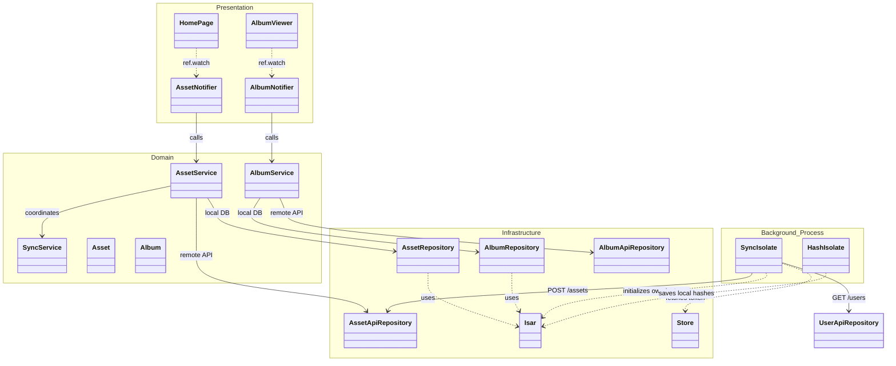

# Mobile Assets & Albums Diagram

This diagram visualizes how the application manages media assets, local/remote albums, and the synchronization between them.

## Asset Management Class Diagram

## Functional Flow
-   **Synchronization**: `SyncService` handles the complex logic of matching local device files with remote server assets.
-   **Background Safety**: `SyncIsolate` and `HashIsolate` run in separate memory spaces. They re-fetch the `accessToken` from the `Store` to ensure requests to the `AssetApiRepository` remain authenticated.
-   **Reactivity**: `AssetRepository` often returns `Streams` from Isar, allowing the UI to update automatically when the background sync adds new photos.
-   **Caching**: `AssetService` manages the logic of when to show a low-res thumbnail vs. fetching high-res data.

## Background Isolate APIs

Background tasks are "mini-apps" that stand on their own to perform data-heavy tasks. They primarily interact with:

1.  **Asset Management (`/assets`)**: 
    - `POST /assets`: Uploads the physical file and metadata.
    - `POST /assets/bulk-upload-check`: Fast deduplication check before uploading.
2.  **User Sync (`/users`)**: 
    - `GET /users`: Syncs profile and partner sharing settings to the local database.
3.  **Connectivity (`/server-info`)**:
    - `GET /server-info/ping`: Verifies server availability before initiating sync.
