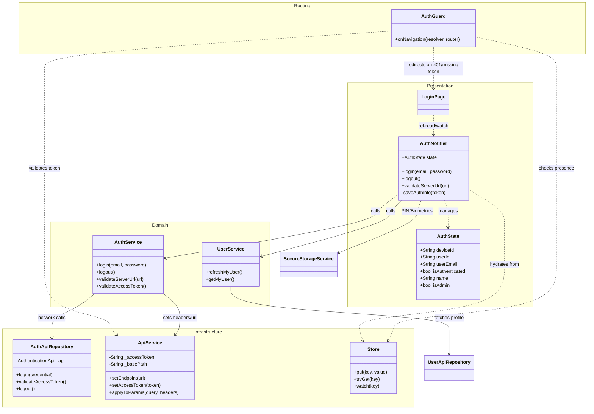

# Mobile Authentication Diagram

This diagram visualizes the classes and data flow specifically related to user authentication, session management, and server validation.

## Authentication Class Diagram

## Role Clarification

### **Service (The Orchestrator)**
*Example: `AuthService`*
- **Role**: Contains high-level business flows.
- **Logic**: Decides *what* should happen. For example, "When logging in, first hit the API, then if successful, update the global `ApiService` headers, then notify the `Store`."
- **Dependencies**: Depends on multiple Repositories or specialized services (like `ApiService`).

### **Repository (The Data Implementation)**
*Example: `AuthApiRepository`*
- **Role**: Encapsulates a single data source.
- **Logic**: Decides *how* to talk to that source. For example, "Call the generated OpenAPI `login` method and return the result." It has no knowledge of application state or other repositories.

### **ApiService (The Technical Utility)**
- **Role**: Manages the underlying HTTP plumbing.
- **Responsibility**: Holds the current `accessToken` and `basePath`. It implements Riverpod's `Authentication` interface to automatically inject the `x-immich-user-token` header into every outbound OpenAPI request.

1.  **Hydration**: On startup, `AuthNotifier` reads the `accessToken` from the local `Store`.
2.  **Validation**: `AuthService` validates the server URL and saves it to `Store`.
3.  **Authentication**: `AuthApiRepository` performs the login; the resulting `accessToken` is used to fetch a `UserDto` via `UserService`.
4.  **State Update**: The `AuthNotifier` populates the in-memory `AuthState` with the combined data.

## Security & Token Expiration

The `isAuthenticated` property in `AuthState` is designed to be **optimistic but verified**:

-   **Optimistic UI**: If a token exists in the `Store`, the app sets `isAuthenticated: true` to allow the user into the app without a splash screen delay.
-   **Routing Enforcement (`AuthGuard`)**: The primary enforcement point. Every time the user navigates or the app wakes up, the `AuthGuard` proactively calls the server to validate the token. If validation fails, it triggers the `router.replaceAll([const LoginRoute()])`.
-   **On-Page Session Expiry**: If a token expires while a user is already on a page (without navigating), the app does not currently use a global reactive redirect. The user will remain on the page until an action triggers a 401 error (handled explicitly by the calling service) or until they navigate, at which point the `AuthGuard` will intercept them.
-   **Server-Side Security**: Regardless of the UI state, the Immich Server remains the source of truth and will reject any requests made with an expired token.
