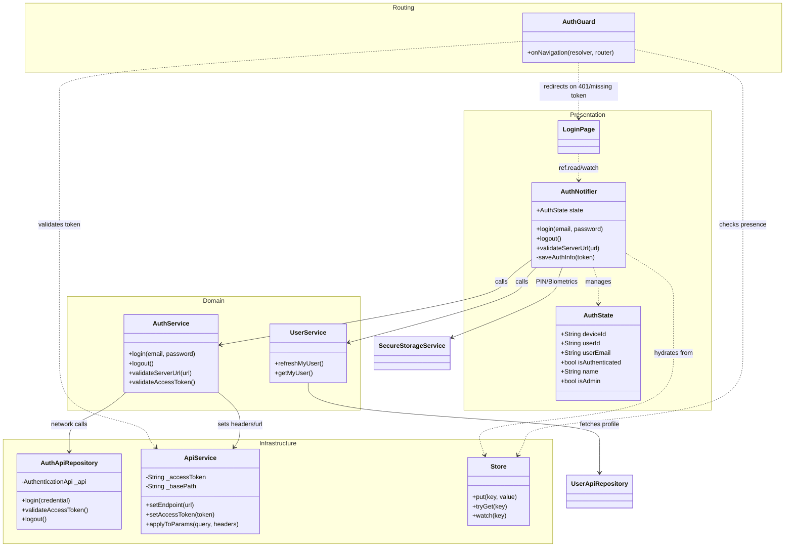
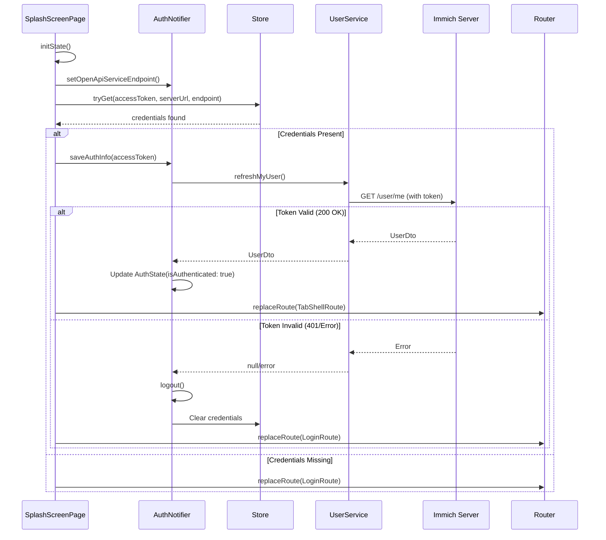
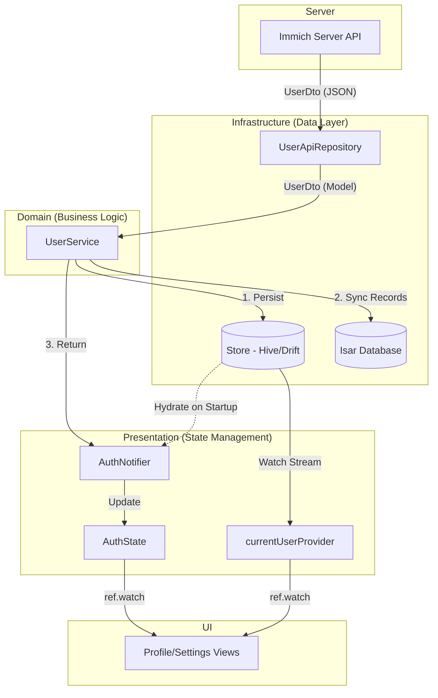

# Mobile Authentication Diagram

This diagram visualizes the classes and data flow specifically related to user authentication, session management, and server validation.

## Authentication Class Diagram

```mermaid
classDiagram
    %% Layers
    namespace Presentation {
        class LoginPage
        class AuthNotifier {
            +AuthState state
            +login(email, password)
            +logout()
            +validateServerUrl(url)
            -saveAuthInfo(token)
        }
        class AuthState {
            +String deviceId
            +String userId
            +String userEmail
            +bool isAuthenticated
            +String name
            +bool isAdmin
        }
    }

    namespace Routing {
        class AuthGuard {
            +onNavigation(resolver, router)
        }
    }

    namespace Domain {
        class AuthService {
            +login(email, password)
            +logout()
            +validateServerUrl(url)
            +validateAccessToken()
        }
        class UserService {
            +refreshMyUser()
            +getMyUser()
        }
    }

    namespace Infrastructure {
        class AuthApiRepository {
            -AuthenticationApi _api
            +login(credential)
            +validateAccessToken()
            +logout()
        }
        class ApiService {
            -String _accessToken
            -String _basePath
            +setEndpoint(url)
            +setAccessToken(token)
            +applyToParams(query, headers)
        }
        class Store {
            +put(key, value)
            +tryGet(key)
            +watch(key)
        }
    }

    %% Relationships
    LoginPage ..> AuthNotifier : ref.read/watch
    AuthNotifier --> AuthService : calls
    AuthNotifier --> UserService : calls
    AuthNotifier ..> AuthState : manages
    AuthNotifier ..> Store : hydrates from

    AuthGuard ..> ApiService : validates token
    AuthGuard ..> Store : checks presence
    AuthGuard ..> LoginPage : redirects on 401/missing token

    AuthService --> AuthApiRepository : network calls
    AuthService --> ApiService : sets headers/url

    UserService --> UserApiRepository : fetches profile

    AuthNotifier --> SecureStorageService : PIN/Biometrics
```

## Role Clarification

### **Service (The Orchestrator)**
*Example: `AuthService`*
- **Role**: Contains high-level business flows.
- **Logic**: Decides *what* should happen. For example, "When logging in, first hit the API, then if successful, update the global `ApiService` headers, then notify the `Store`."
- **Dependencies**: Depends on multiple Repositories or specialized services (like `ApiService`).

### **Repository (The Data Implementation)**
*Example: `AuthApiRepository`*
- **Role**: Encapsulates a single data source.
- **Logic**: Decides *how* to talk to that source. For example, "Call the generated OpenAPI `login` method and return the result." It has no knowledge of application state or other repositories.

### **ApiService (The Technical Utility)**
- **Role**: Manages the underlying HTTP plumbing.
- **Responsibility**: Holds the current `accessToken` and `basePath`. It implements Riverpod's `Authentication` interface to automatically inject the `x-immich-user-token` header into every outbound OpenAPI request.

1.  **Hydration**: On startup, `AuthNotifier` reads the `accessToken` from the local `Store`.
2.  **Validation**: `AuthService` validates the server URL and saves it to `Store`.
3.  **Authentication**: `AuthApiRepository` performs the login; the resulting `accessToken` is used to fetch a `UserDto` via `UserService`.
4.  **State Update**: The `AuthNotifier` populates the in-memory `AuthState` with the combined data.

## Security & Token Expiration

The `isAuthenticated` property in `AuthState` is designed to be **optimistic but verified**:

-   **Optimistic UI**: If a token exists in the `Store`, the app sets `isAuthenticated: true` to allow the user into the app without a splash screen delay.
-   **Routing Enforcement (`AuthGuard`)**: The primary enforcement point. Every time the user navigates or the app wakes up, the `AuthGuard` proactively calls the server to validate the token. If validation fails, it triggers the `router.replaceAll([const LoginRoute()])`.
-   **On-Page Session Expiry**: If a token expires while a user is already on a page (without navigating), the app does not currently use a global reactive redirect. The user will remain on the page until an action triggers a 401 error (handled explicitly by the calling service) or until they navigate, at which point the `AuthGuard` will intercept them.
- **Server-Side Security**: Regardless of the UI state, the Immich Server remains the source of truth and will reject any requests made with an expired token.

## Session Resumption Flow (Re-authentication)

This diagram describes the process of automatically logging the user back in when the app is launched.

```mermaid
sequenceDiagram
    participant S as SplashScreenPage
    participant AN as AuthNotifier
    participant ST as Store
    participant US as UserService
    participant SRV as Immich Server
    participant R as Router

    S->>S: initState()
    S->>AN: setOpenApiServiceEndpoint()
    S->>ST: tryGet(accessToken, serverUrl, endpoint)
    ST-->>S: credentials found

    alt Credentials Present
        S->>AN: saveAuthInfo(accessToken)
        AN->>US: refreshMyUser()
        US->>SRV: GET /user/me (with token)

        alt Token Valid (200 OK)
            SRV-->>US: UserDto
            US-->>AN: UserDto
            AN->>AN: Update AuthState(isAuthenticated: true)
            S->>R: replaceRoute(TabShellRoute)
        else Token Invalid (401/Error)
            SRV-->>US: Error
            US-->>AN: null/error
            AN->>AN: logout()
            AN->>ST: Clear credentials
            S->>R: replaceRoute(LoginRoute)
        end
    else Credentials Missing
        S->>R: replaceRoute(LoginRoute)
    end
```

## User Data Synchronization Flow

This diagram illustrates how user profile data (`UserDto`) is propagated through the system and stored across multiple layers.

```mermaid
flowchart TD
    subgraph Server
        API[Immich Server API]
    end

    subgraph "Infrastructure (Data Layer)"
        REPO[UserApiRepository]
        STORE[(Store - Hive/Drift)]
        ISAR[(Isar Database)]
    end

    subgraph "Domain (Business Logic)"
        US[UserService]
    end

    subgraph "Presentation (State Management)"
        AN[AuthNotifier]
        CUP[currentUserProvider]
        AS[AuthState]
    end

    subgraph UI
        VIEW[Profile/Settings Views]
    end

    %% Sync Flow (Online)
    API -- "UserDto (JSON)" --> REPO
    REPO -- "UserDto (Model)" --> US
    
    US -- "1. Persist" --> STORE
    US -- "2. Sync Records" --> ISAR
    
    US -- "3. Return" --> AN
    AN -- "Update" --> AS
    
    %% Startup / Hydration Flow
    STORE -. "Hydrate on Startup" .-> AN
    
    STORE -- "Watch Stream" --> CUP
    
    AS -- "ref.watch" --> VIEW
    CUP -- "ref.watch" --> VIEW
```

### Data Storage Purpose
1.  **Store (Hive/Drift)**: Used for fast key-value access and session resumption. It is the source for the `currentUserProvider` stream.
2.  **Isar Database**: Used for relational data and cross-referencing. It stores the `User` entity which can include all known users (partners, contributors), enabling offline gallery features and metadata association.
3.  **AuthState**: Holds the volatile state of the *current active session*. It combines server profile data with device-specific information (like `deviceId`).

### Why the Redundancy?

This "double storage" (in-memory state vs. persistent database) is a common architectural pattern in the mobile app for several reasons:

*   **User (The Record)**: Acts as the "source of truth" for the local database. It allows the app to show who owns which photo, even for users other than yourself (like your partner or contributors in a shared album).
*   **AuthState (The Session)**: Acts as the "source of truth" for the current UI state. It answers the question: *"Who is currently using the app right now, and what are they allowed to do?"*

**In summary:** `AuthState` is about the **current session** (Login status + My Profile), while the Isar `User` entity is about **persistent records** (My Profile + Others' Profiles + Quotas). When the user profile is refreshed, the app updates the persistent record first, then "hydrates" that change into the `AuthState` so the UI reflects it immediately.

