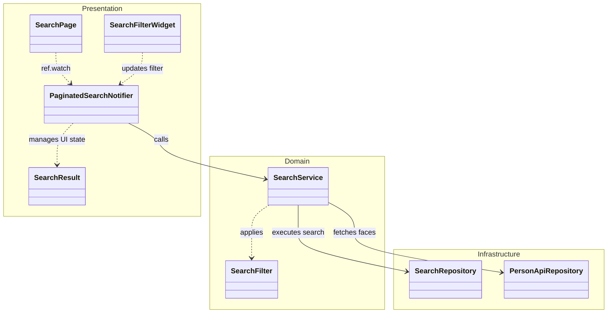

# Mobile Search & Discovery Diagram

This diagram visualizes the search functionality, including filters, pagination, and machine-learning-powered discovery.

## Search Class Diagram

## Search Flow
1.  **Input**: User enters text or selects a face in `SearchFilterWidget`.
2.  **ViewModel**: `PaginatedSearchNotifier` resets the page count and updates the `SearchFilter`.
3.  **Orchestration**: `SearchService` sends the request to the `SearchRepository`.
4.  **Result**: The `SearchResult` (containing assets and pagination metadata) is returned to the notifier, which updates the UI.
