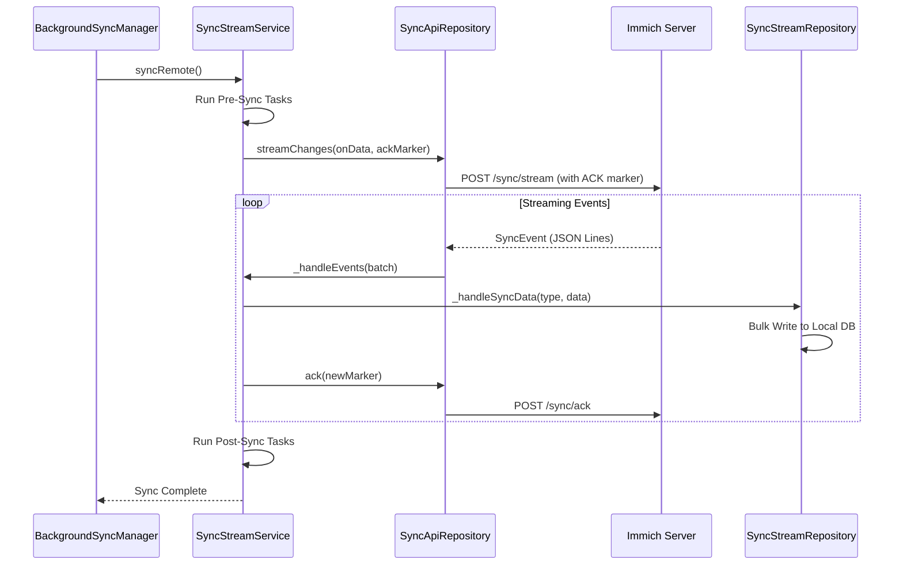

# Mobile Synchronization Mechanism

The Immich mobile app uses a sophisticated **Delta Synchronization** system to keep its local database (Drift/Isar) in sync with the server with minimal data usage and high performance.

The primary orchestrator of this process is the **`SyncStreamService`**.

## Core Components

- **`SyncStreamService`**: The high-level service that manages the overall synchronization flow, including pre-sync and post-sync migration tasks.
- **`SyncApiRepository`**: Handles the low-level streaming communication with the server's `/sync/stream` endpoint.
- **`SyncStreamRepository`**: Performs high-speed bulk database operations (inserts, updates, deletes) in the local database.
- **`BackgroundSyncManager`**: Coordinates various synchronization tasks (remote sync, local sync, hashing, cloud ID migration) and handles background/foreground execution.

## Technical Flow

The synchronization process follows a "Delta" pattern, meaning only changes since the last known state are transmitted.

### 1. Connection & Negotiating
The app establishes a connection to the server's `/sync/stream` endpoint. It sends a list of entity types it wants to track and an **ACK marker** (a token representing the last successfully synchronized point).

### 2. Delta Event Streaming
The server responds with a stream of **`SyncEvent`** objects (using JSON Lines format). Each event contains:
- **`type`**: The entity being changed (e.g., `assetV1`, `albumUserDeleteV1`, `userV1`).
- **`data`**: The actual updated data or the ID of the deleted entity.
- **`ack`**: A new marker to confirm receipt of this specific change.

### 3. Batch Processing
To maintain high performance and UI responsiveness, the `SyncStreamService` batches these events. It processes them in bulk using `SyncStreamRepository`, which performs optimized database writes using Drift/Isar batch transactions.

## Synchronization Scenarios

The app triggers a remote sync in several key scenarios:

| Trigger | Purpose |
| :--- | :--- |
| **App Launch** | Catch up on all changes made while the app was closed (e.g., deletions from the Web UI). |
| **App Foregrounding** | Refresh the timeline immediately when the user returns to the app. |
| **Websocket Signals** | Real-time updates. When the server finishes processing an asset, it sends a signal; the app then syncs that specific change immediately. |
| **Background Workers** | Keeps the local database updated for widgets and background processing even when the app is not in the foreground. |
| **Manual Trigger** | Users can force a full or delta sync via the **Settings > Backup** or **Advanced** menus. |

## What is Synchronized?

The `SyncStreamService` keeps track of almost all business entities:
- **Assets**: Metadata, EXIF data, visibility, and cloud IDs.
- **Albums**: Creation, deletion, sharing settings, and user permissions.
- **Users**: Profile updates (name, email) and partner sharing configurations.
- **System**: Face recognition data (People), Memories, and Stacks.

This mechanism ensures that the Immich mobile app remains an "offline-first" experience, providing a near-perfect mirror of the server's state while minimizing network overhead.
